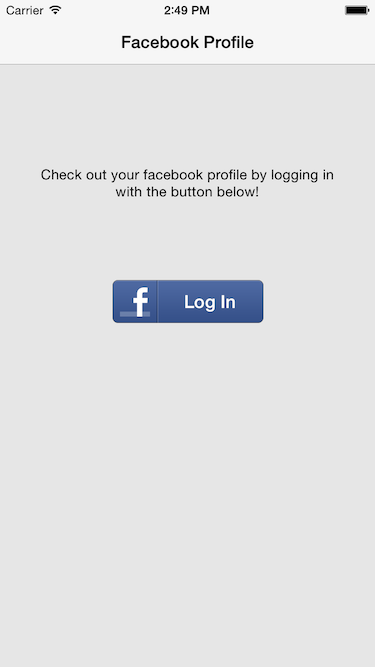
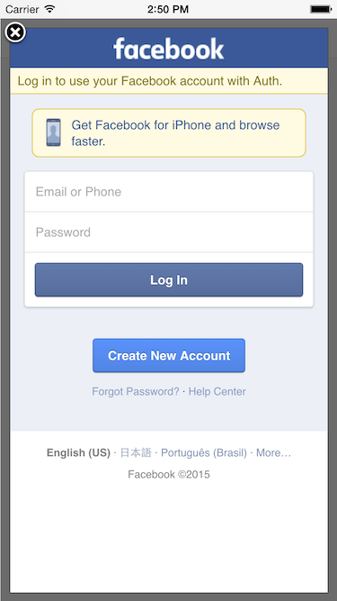
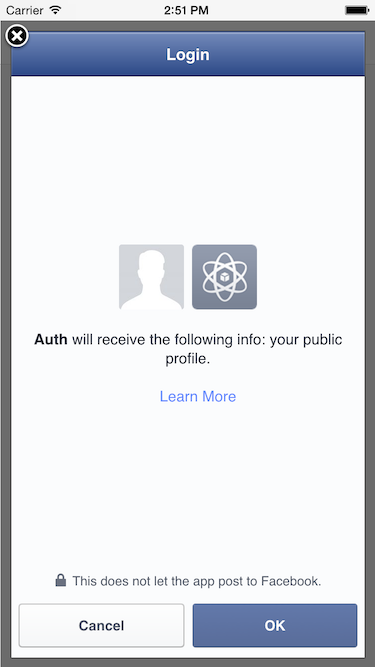
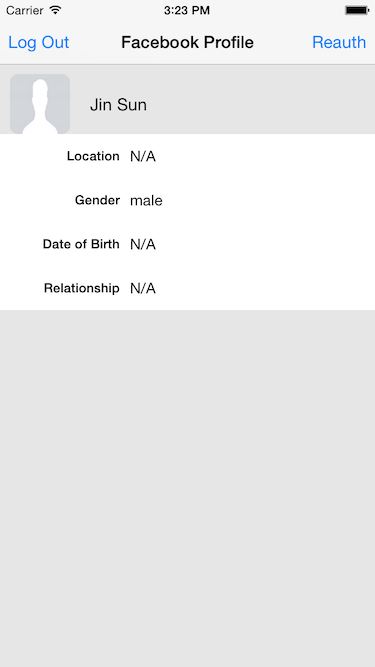

# Demo-Auth-iOS

## Overview

The project teaches you how to use MaxLeap user authentication and integrate with third platforms authentication.

Temporarily, only Facebook authentication was integrated into this project. More authentications will be integrated soon!

## Screenshots

## How to Run

1. Clone the repository and open the Xcode project at `Demo-Auth-iOS/Auth.xcodeproj`.
2. Go to MaxLeap console, create a maxleap app.
3. Add colume `profile` with type `Object` into class `_User`.
4. Add your MaxLeap application id and client key in `AppDelegate.m`.

### Integrating Facebook

1. Set your Facebook application id in the FacebookAppID property in Auth-info.plist.
2. Set your Facebook application id as a URLType Project > Info > URL Types > Untitled > URL Schemes using the format fbYour_App_id (eg. for 12345, enter fb12345).

