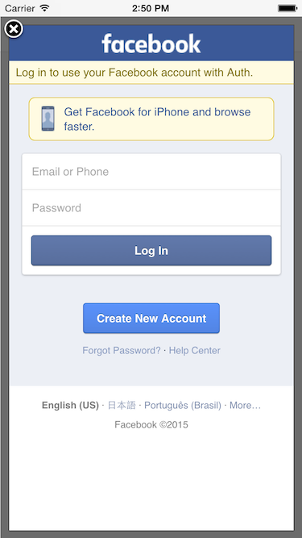

# LAS-Demo-Auth-iOS

## 介绍

这个项目介绍如何使用 LAS 的用户认证系统和与第三方平台认证系统集成。暂时只集成了 Facebook 登陆。

## 演示功能

- LAS 用户认证，注册、登录、保存用户信息
- 与 Facebook SDK 集成
- 使用 Facebook SDK

## 效果截图

## 如何运行

1. 登陆 leap.as, 创建一个 LAS 应用。
2. 克隆这个仓库，打开项目
3. 在 `AppDelegate.m` 中填入 application id 和 client key。
4. 在 Auth-info.plist 中的 FAcebookAppId 属性下填写 Facebook 应用 Id。
5. Xcode 导航到 Project > Info > URL Types > Untitled > URL Schemes, 使用 Facebook id 设置一个 URLType, 格式为 fbYour_App_id（例如：对于id 12345, 输入 fb12345）.

