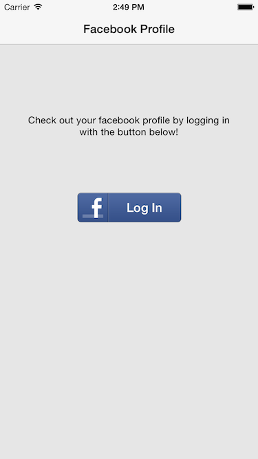
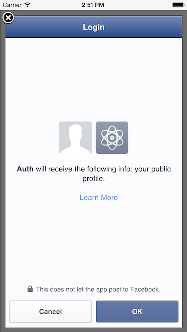
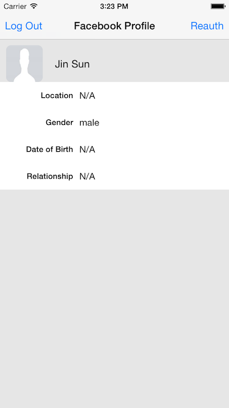

# Demo-Auth-iOS

## 介绍

这个项目介绍如何使用 MaxLeap 的用户认证系统和与第三方平台认证系统集成。暂时只集成了 Facebook 登陆。

## 演示功能

- MaxLeap 用户认证，注册、登录、保存用户信息
- 与 Facebook SDK 集成
- 使用 Facebook SDK

## 效果截图

## 如何运行

1. 克隆这个仓库，打开项目
2. 登陆 [MaxLeap 开发者控制台](https://maxleap.cn), 创建一个 MaxLeap 应用。
3. 打开 `AppDelegate.m`，将宏定义 `MaxLeap_AppId` 和 `MaxLeap_ClientKey` 换成刚才创建的应用的。设置应用服务器 `MaxLeap_site` （中国区 MLSiteCN，美国区 MLSiteUS）.

### 集成 Facebook

1. 前往 MaxLeap 开发者控制台 -> 开发者中心 -> 云数据，选中 `_User` 类，添加列 `facebookProfile`，类型为 `Object` (这里是 JSONObject，映射到 SDK 中就是 NSDictionary)。
2. 前往 Facebook 开发者平台，创建一个应用。
3. 将 Facebook App ID 填写到 Auth-info.plist 中的 `FacebookAppId` 字段下。
4. 打开 Xcode，导航到 Project > Info > URL Types > Untitled > URL Schemes, 使用 Facebook App ID 设置一个 URLType, 格式为 fbYour_App_id（例如：对于id 12345, 输入 fb12345）.

### 集成微博

1. 前往 MaxLeap 开发者控制台 -> 开发者中心 -> 云数据，选中 `_User` 类，添加列 `weiboProfile`，类型为 `Object` (这里是 JSONObject，映射到 SDK 中就是 NSDictionary)。
2. 前往微博开放平台，创建一个移动应用。
3. 打开 Xcode，将 `AppDelegate.m` 中的宏定义 `Weibo_AppKey` 和 `Weibo_RedirectURI` 换成刚才创建的微博应用的。
4. 添加微博回调地址 URL Scheme，格式: wb{Weibo_AppKey}，例如 wb204543436852

### 集成微信

1. 前往 MaxLeap 开发者控制台 -> 开发者中心 -> 云数据，选中 `_User` 类，添加列 `wechatProfile`，类型为 `Object` (这里是 JSONObject，映射到 SDK 中就是 NSDictionary)。
2. 前往微信开放平台，创建一个移动应用。
3. 打开 Xcode，将 `AppDelegate.m` 中的宏定义 `Weixin_AppId` 和 `Weixin_AppSecret` 换成刚才创建的微博应用的。
4. 添加微信回调地址 URL Scheme，填写 Weixin_AppId